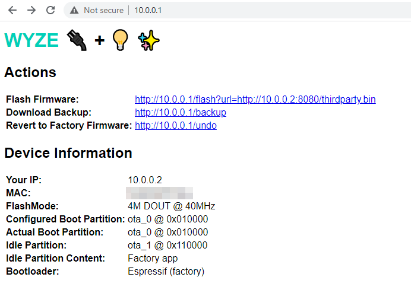

# Requirements

1. [**Wyze Plug**](https://wyze.com/wyze-plug.html) (model WLPP1) or [**Wyze Bulb**](https://wyze.com/wyze-bulb.html) (model WLPA19).
2. **A third party firmware bin.** I've only tested Tasmota 9.2's full build. esp2ino *should* work with ESPurna, esphome, and any other firmware package built using the ESP8266 Arduino framework.
3. **A computer that supports Python and has an 802.11 b/g/n Wi-Fi adapter.** esp2ino is confirmed to work in Windows, MacOs, and Linux (Ubuntu).

If you're brave enough to test a different device or a different third party firmware, please open a GitHub issue or submit a pull request with a change to this document.

# Instructions

These instructions assume use of Windows, Wyze Plug as target device, familiarity with the command line, and Tasmota as your target firmware. If you're so inclined, use a Python virtual environment.

## SET UP ENVIRONMENT

1. Install [Python 3](https://www.python.org/downloads/) and [git](https://git-scm.com/) using the standard Windows installers.
2. Create a folder on your computer to hold all of the files required for this project. This guide assumes  `c:\esp2ino`.
3. Open a command prompt in the project folder.
4. From the command prompt, download and install [pip](https://pip.pypa.io/en/stable/installing/):
   
        curl https://bootstrap.pypa.io/get-pip.py -o get-pip.py
        py get-pip.py

5. Use pip to install the Python `requests` library:

        pip install requests 

## DOWNLOAD COMPONENTS

1. Clone [WyzeUpdater](https://github.com/HclX/WyzeUpdater) into `c:\esp2ino` so that `wyze_updater.py` is accessible at `c:\esp2ino\WyzeUpdater\wyze_updater.py`. From `c:\esp2ino`, run:
        
        git clone https://github.com/HclX/WyzeUpdater.git

2. Download the latest `wyze_plug_flasher.bin` from [this repo's Releases page](https://github.com/elahd/wyze_plug_flasher/releases) into  `c:\esp2ino` so that it is accessible as `c:\esp2ino\wyze_plug_flasher.bin`. From `c:\esp2ino`, run:

        curl -L https://github.com/elahd/wyze_plug_flasher/releases/latest/download/wyze_plug_flasher.bin -o wyze_plug_flasher.bin

3. Download the [latest Tasmota bin](https://github.com/arendst/Tasmota/releases/tag/v9.2.0) into  `c:\esp2ino` so that it is accessible as `c:\esp2ino\thirdparty.bin`. *Be sure to use the full, uncompressed installer with the filename `tasmota.bin`.* From `c:\esp2ino`, run:

        curl -L http://ota.tasmota.com/tasmota/release/tasmota.bin -o thirdparty.bin

4. If you downloaded  `tasmota.bin` using a web browser, be sure to rename it to `thirdparty.bin`.

## LOAD WYZE PLUG FLASHER ON TO DEVICE
1. Use WyzeUpdater to get a list of your Wyze devices. From `c:\esp2ino\WyzeUpdater`, run:
   
        py wyze_updater.py list

    When prompted, enter your username, password, and OTP to log in.
2. Find the Wyze Plug you want to flash and copy its Device MAC.
3. Use WyzeUpdater to push Wyze Plug Flasher on to the device, replacing `DEVICEMAC` with the value obtained in the prior step:

        py wyze_updater.py update -s -d DEVICEMAC -f ../wyze_plug_flasher.bin

    *Don't forget the -s! The update will fail without it.*

4. When prompted, confirm the device selection. WyzeUpdater will spin up a web server to serve wyze_plug_flasher.bin and will tell the Wyze Plug to download the file from your computer.
5. ⌚ **Wait....** The update takes around two minutes to complete. You'll know it's done when the `wyze_plug_flasher` Wi-Fi network is available:

    

6. Back in your command prompt window, hit `Ctrl + C` to kill the server and quit WyzeUpdater.

## LOAD WYZE PLUG FLASHER ON TO DEVICE

1. Connect to the `wyze_plug_flasher` Wi-Fi network.
2. Run a Python web server to serve `thirdparty.bin` (Tasmota). From `c:\esp2ino`, run:

        py -m http.server 8080

    You'll see the following if the web server has started successfully:

        Serving HTTP on :: port 8080 (http://[::]:8080/) ...

3. In a web browser, go to [`http://10.0.0.1`](http://10.0.0.1) to access the Wyze Plug Flasher control panel:

    

4. **Click on the link next to Flash Firmware to download and install Tasmota.** If you're having second thoughts, this is your last opportunity to revert to factory firmware. (Click on the link next to "Revert to Factory Firmware".) **You will not be able to switch back to Wyze's stock firmware once third party firmware has been installed.**
5. **⌚ Wait again...** This update runs slightly longer than the last one. You'll see a confirmation message in your web browser once the download is complete:
   
   

   After the device downloads Tasmota, it will reboot, rearrange some files, then boot into Tasmota. *It's critical that you don't disturb the device on the initial boot. No button pushing, unplugging, reloading the web page, etc.*
6. Kill the Python web server by pressing `Ctrl + C` in the command prompt window.

## SET UP TASMOTA

**DON'T CONNECT TASMOTA TO YOUR WIFI NETWORK JUST YET!** First, we need to purge Wyze's Wi-Fi calibration data from the plug's flash chip. If we don't remove this data, the plug will disconnect from Wi-Fi every 30-60 seconds.

1. Connect to the Tasmota Wi-Fi network:

    

2. In a web browser, go to [`http://192.168.4.1/cs`](http://192.168.4.1/cs):

    

3. Enter `Reset 5` in the command input field and hit `Enter`. The device will reboot.
4. After the device reboots, unplug it. That is, physically remove it from the electrical outlet for a few seconds.
5. Plug the device back in.
6. Set up Tasmota as you normally would.

### Device Template

#### Wyze Plug
    {"NAME":"WyzePlugWLPP1","GPIO":[0,0,0,0,0,56,0,0,21,0,17,0,0],"FLAG":0,"BASE":18}

   *[(via Tasmota Device Templates Repository)](https://templates.blakadder.com/wyze_WLPP1.html)*

#### Wyze Bulb
    {"NAME":"Wyze Bulb","GPIO":[5728,0,0,0,0,0,0,0,0,416,417,0,0,0],"FLAG":0,"BASE":48}

   *[(via Tasmota Device Templates Repository)](https://templates.blakadder.com/wyze_WLPA19.html)*

# Misc
##  Supported Devices (Extended)
 Theoretically, esp2ino supports any ESP8266-based device that meets the below criteria:
1. Uses an ESP8266 microchip.
2. Uses [version 3](https://docs.espressif.com/projects/esp8266-rtos-sdk/en/latest/api-guides/fota-from-old-new.html) of the [ESP8266 RTOS SDK](https://github.com/espressif/ESP8266_RTOS_SDK).
3. Uses ESP8266 RTOS SDK's [built-in FOTA libraries](https://github.com/espressif/ESP8266_RTOS_SDK/tree/master/examples/system/ota).
4. Uses ESP8266 RTOS SDK's standard ["Two OTA" partition map](https://docs.espressif.com/projects/esp8266-rtos-sdk/en/latest/api-guides/partition-tables.html).

The trick is figuring out how to load esp2ino onto these devices. [HclX](https://github.com/HclX) figured it out for Wyze devices via [WyzeUpdater](https://github.com/HclX/WyzeUpdater). If you have a method for loading firmware 
## esp2ino vs tuya-convert
esp2ino borrows concepts (and some code) from tuya-convert. For background, Tuya-convert has two basic parts:

1. **Firmware loader.** This tricks the IoT device into accepting third party firmware by emulating Tuya's cloud infrastructure.
2. **Intermediate firmware.** This firmware modifies the device's bootloader to accept Arduino-based firmwares.

esp2ino is different from tuya-convert in the following ways:

1. **Firmware loader.** esp2ino currently targets two Wyze products and uses the [WyzeUpdater](https://github.com/HclX/WyzeUpdater) script to push esp2ino's intermediate firmware onto devices. I'm looking for help identifying and building loaders for other devices, including from other manufacturers.
2. **Intermediate firmware.** Tuya-convert's intermediate firmware targets devices with firmware built on versions < 3.0 of the [ESP8266 RTOS SDK](https://github.com/espressif/ESP8266_RTOS_SDK). esp2ino targets devices with firmware build on [ESP8266 RTOS SDK](https://github.com/espressif/ESP8266_RTOS_SDK) versions >= v 3.0.

# Sources

This project borrows bits and pieces from:
1. [Tuya-Convert](https://github.com/ct-Open-Source/tuya-convert)
2. Espressif's [ESP8266_RTOS_SDK program samples](https://github.com/espressif/ESP8266_RTOS_SDK/tree/master/examples).

***